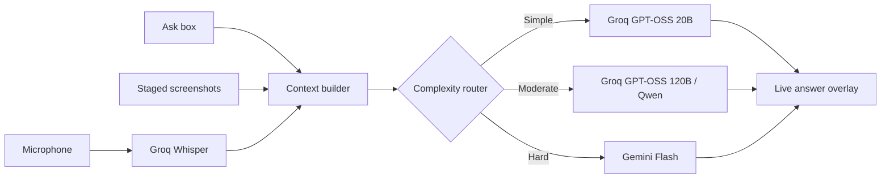

<div align="center">

<svg width="900" height="260" viewBox="0 0 900 260" role="img" aria-label="NetworkCap: a low-latency cloud AI workspace">
  <defs>
    <linearGradient id="bg" x1="0" x2="1" y1="0" y2="1">
      <stop offset="0" stop-color="#07131c" />
      <stop offset="0.55" stop-color="#0d2630" />
      <stop offset="1" stop-color="#13261f" />
    </linearGradient>
    <linearGradient id="signal" x1="0" x2="1">
      <stop offset="0" stop-color="#63e6be" stop-opacity="0" />
      <stop offset="0.45" stop-color="#63e6be" />
      <stop offset="1" stop-color="#a8f07b" stop-opacity="0" />
    </linearGradient>
    <filter id="glow"><feGaussianBlur stdDeviation="5" result="blur" /><feMerge><feMergeNode in="blur" /><feMergeNode in="SourceGraphic" /></feMerge></filter>
    <pattern id="grid" width="32" height="32" patternUnits="userSpaceOnUse"><path d="M32 0H0V32" fill="none" stroke="#b7f5d6" stroke-opacity=".08" /></pattern>
  </defs>
  <rect width="900" height="260" rx="22" fill="url(#bg)" />
  <rect width="900" height="260" rx="22" fill="url(#grid)" />
  <path d="M-80 205C150 115 265 260 470 164S740 90 980 158" fill="none" stroke="url(#signal)" stroke-width="2" filter="url(#glow)">
    <animate attributeName="d" dur="5s" repeatCount="indefinite" values="M-80 205C150 115 265 260 470 164S740 90 980 158;M-80 170C150 250 265 100 470 192S740 210 980 118;M-80 205C150 115 265 260 470 164S740 90 980 158" />
  </path>
  <circle cx="690" cy="75" r="54" fill="#63e6be" fill-opacity=".08"><animate attributeName="r" values="46;64;46" dur="3.5s" repeatCount="indefinite" /></circle>
  <circle cx="690" cy="75" r="5" fill="#a8f07b" filter="url(#glow)"><animate attributeName="opacity" values="1;.35;1" dur="1.7s" repeatCount="indefinite" /></circle>
  <text x="64" y="92" fill="#f1fff8" font-family="system-ui, sans-serif" font-size="56" font-weight="700" letter-spacing="-2">NetworkCap</text>
  <text x="68" y="130" fill="#9edac4" font-family="system-ui, sans-serif" font-size="19">A quiet, low-latency AI overlay for thinking in public.</text>
  <text x="68" y="185" fill="#63e6be" font-family="ui-monospace, monospace" font-size="14">VOICE  /  SCREEN CONTEXT  /  ROUTED REASONING</text>
  <text x="68" y="214" fill="#6e8f8a" font-family="ui-monospace, monospace" font-size="12">CLOUD STT + 3-TIER LLM FAILOVER</text>
</svg>

<br />

[](package.json)
[](https://github.com/gempro382-coder/NetworkCap)
[](LICENSE)

</div>

> NetworkCap is a Windows-first Electron workspace that listens, reads the right screen context, and routes each question to the right cloud model. It is designed for interview practice, coding, and fast general reasoning without downloading local AI models.

## The idea

NetworkCap keeps the interface close to your work: a compact transparent overlay, a live transcript, an answer surface, and a terminal when you need one. Audio goes to Groq Whisper. Questions are classified by complexity and sent through a three-tier route, with model-level failover when a provider is slow, rate-limited, or unavailable.



## What makes it different

| Layer | Behavior | Why it matters |
| --- | --- | --- |
| **Capture** | Groq Whisper Large V3 Turbo, with V3 fallback | Fast speech-to-text without local model weight |
| **Context** | Full-resolution desktop screenshots can be staged before sending | Add visual context deliberately instead of sending every frame |
| **Routing** | Simple, moderate, and hard question tiers | Spend latency and model capacity where it helps |
| **Failover** | Ordered provider and model fallback chains | A transient API failure does not end the conversation |
| **Overlay** | Frameless, persistent, transparent Electron window | Keep answers available without leaving the current app |
| **Controls** | Global shortcuts, click-through mode, opacity, terminal, and trays | Operate quickly without hunting through menus |

## Quick start

### Requirements

- Windows x64 for the complete overlay and capture experience
- Node.js 20 or newer
- A [Groq API key](https://console.groq.com/keys) for Whisper STT and fast LLM tiers
- A [Google AI Studio API key](https://aistudio.google.com/apikey) for Gemini hard-question routing and fallback

### Install and run

```bash
npm install
npm start
```

On first launch, enter both keys in the setup screen, select an answer mode, run the environment checks, and start the workspace. Credentials are stored locally in `~/.networkcap/config.json`; they are not rendered in full in the UI.

## Interaction model

The overlay is built for keyboard-first use. The defaults are shown below; `CommandOrControl` means `Ctrl` on Windows.

| Shortcut | Action |
| --- | --- |
| `Ctrl+Shift+V` | Start or stop microphone capture |
| `Ctrl+Shift+S` | Stage a screenshot |
| `Ctrl+Shift+D` | Send staged screenshots |
| `Ctrl+Shift+X` | Toggle click-through mode |
| `Ctrl+Shift+H` | Show or hide the overlay |
| `Ctrl+Shift+T` | Toggle the integrated terminal |
| `Ctrl+Shift+K` | Stop the active AI request |
| `Ctrl+Shift+R` | Reset the overlay window |
| `Ctrl+Shift+Up / Down` | Increase or decrease opacity |
| `Ctrl+Shift+Q` | Remove the last staged screenshot |
| `Ctrl+Shift+O` | Close the response overlay |
| `Ctrl+Shift+L` | Open the shortcuts panel |
| `Ctrl+W` | Quit NetworkCap |

Inside the answer surface, `Ctrl+Arrow` keys scroll vertically or through wide code. In the Ask box, `Enter` sends and `Shift+Enter` inserts a newline.

## Model routing

NetworkCap uses cloud APIs only. There are no local STT or LLM models hidden in the package.

```text
Tier 1  Simple    Groq GPT-OSS 20B       -> Gemini Flash Lite fallback
Tier 2  Moderate  Groq GPT-OSS 120B      -> Qwen 3.6 27B -> Gemini fallback
Tier 3  Hard      Gemini 3.7 Flash        -> Gemini 3.6 -> Gemini 3.5
```

The router also tracks usage and can stop or fall back cleanly when a request is aborted. Model selection and answer mode are available in the setup and settings surfaces.

## Build a portable Windows executable

```bash
npm run build:win
```

The packaged artifact is written to `release/NetworkCap.exe`. To build without publishing:

```bash
npm run dist:win
```

The app is packaged with Electron Builder as a portable x64 executable. Native `koffi` bindings are unpacked automatically during packaging.

## Development checks

```bash
npm test
npm run test:load
```

The test suite covers visibility behavior, answer formatting, load paths, shortcut help, and empty-provider responses.

## Project map

```text
src/
  main.js                       Electron lifecycle, windows, IPC, shortcuts
  preload.js                    Context-isolated renderer bridge
  core/                         Config, visibility, and healing behavior
  renderer/                     Setup screen, overlay UI, and interactions
  services/                     STT, LLM, routing, capture, audio, and usage
  shared/                       Constants and logging primitives
bin/                            CLI entrypoint and Windows packaging scripts
packaging-hooks/                Electron Builder hooks
tests/                          Behavior and module-load checks
```

## Privacy and boundaries

- API credentials remain in the local NetworkCap config directory.
- Audio transcription and LLM inference are sent to the configured cloud providers.
- Screenshots are only included when you explicitly stage and send them.
- NetworkCap is an assistive workspace, not a substitute for professional judgment or interview rules.

## License

NetworkCap is released under the MIT License, as declared in `package.json`.

<div align="center">

<sub>Built for the moment between hearing a question and finding the clearest answer.</sub>

</div>
